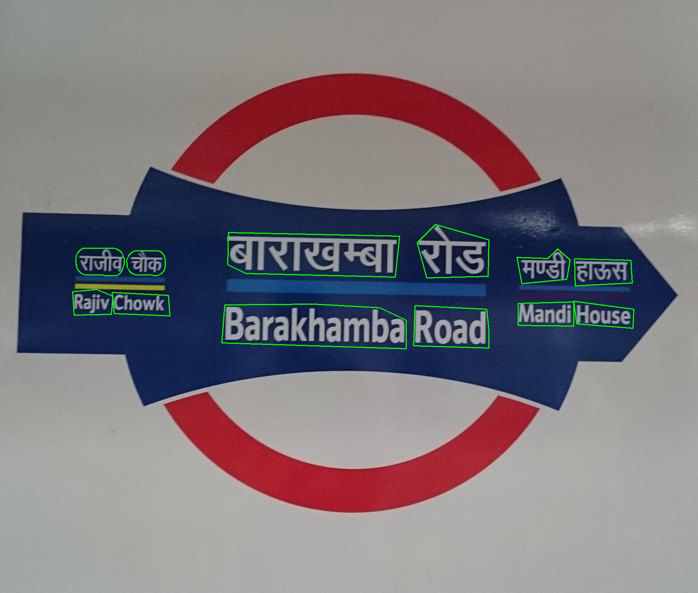
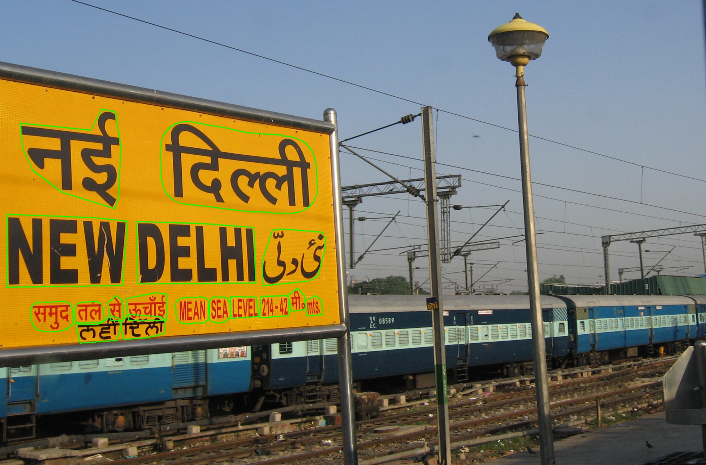

<h1 align="center"> Bharat Scene Text Dataset</h1>

<div align="center">

[](https://github.com/Bhashini-IITJ/BharatSceneTextDataset/stargazers/)


</div>


Bharat Scene Text Dataset (BSTD) is large and real Indian language scene-text dataset with coverage across **13 Indian languages** and English. It consists of 6,582 scene-text images, with polygon bounding box annotations of 1,20,560 words and ground truth text annotations of 1,00,495 cropped words. This dataset is an effort towards scaling scene-text detection and recognition systems to work on Indian languages. The current version of this dataset can be used for studying scene text detection and cropped scene text word recognition.

[comment]: <> (Add a table with 13 languages and links to its files)

# Release updates:

[comment]: <> (checkbox style release updates with cross ticks for the ones present)

- [8/8/24] First Public Release.

# Data Statistics:

### Scene Text Detection

| Total images | #Total bounding box (bb) | #Train Images | #Test Images |
| :---: | :---: | :---: | :---: |
| 6,582 | 1,20,560 | 5,263 (#bb = 94,128) | 1,319 (#bb = 26,432) |

### Cropped Word Recogntion
| Language | #Total recognition annotations | #Train | #Test|
| :-------- | -----: | -----: | ----: |
| assamese  |  3970  |  2627  |  1343 |
| bengali   |  6093  |  4936  |  1157 |
| gujarati  |  2552  |  1884  |   668 |
| english   | 37313  | 29123  |  8190 |
| hindi     | 18983  | 14927  |  4056 |
| kannada   |  2900  |  2208  |   692 |
| malayalam |  2955  |  2393  |   562 |
| marathi   |  4960  |  3917  |  1043 |
| odia      |  4164  |  3148  |  1016 |
| punjabi   | 10825  |  8319  |  2506 |
| tamil     |  2532  |  2029  |   503 |
| telugu    |  2693  |  2215  |   478 |
| others    | 20620  |    -   |    -  |
| total     | 120560 | 77726  | 22214 |


## Task 1: Scene text detection

### Data Download:
Download the detection.zip from the [link](https://drive.google.com/file/d/16irnMGdT8ohhvfMMG3qbBKWKxcPLNF0y/view?usp=share_link) (zip file ~17 GB).
#### To download:
> ```
>pip install gdown
> gdown --id {file_id} --output {output_file_name.zip}
> ```
Annotations are in BSTD_release_v1.json

### File structure

    Detection/
    │
    ├── A/
    │   ├── image_xx.jpg
    │   ├── ...
    │   └── image_xx.jpg
    ├── B/
    ├── C/
    ├── ...
    ├── M/
    └── BSTD_release_v1.json

### Annotation Format (BSTD_release_v1.json):
Words in the image are annotated in the polygon format. The annotation file is a json file with the following format:
```
"folderName_image_id": {
    "annotations": 
    {
        "polygon_0":
        {
            "coordinates":
                [
                    [x1, y1],
                    [x2, y2],
                    ...,
                    [xn, yn]
                ],
            "text": "text in the current polygon",
            "script_language" : "language of the word present in the polygon."
        },
        ...,
        "polygon_n":
        {
            "coordinates":
                [
                    [x1, y1],
                    [x2, y2],
                    ...,
                    [xn, yn]
                ],
            "text": "text in the current polygon",
            "script_language" : "language of the word present in the polygon."
        }
    },
    "url": "url of the image",
    "image_name": "path to the image",
    "split" : "train/test split"
    "folderName": "folder of the image"
}
```

## Task 2: Cropped word recognition

### Data Download:
Download the recognition.zip from the [link](https://drive.google.com/file/d/1wvlTbGnpnSRspM5MbjDgfSMH3BwM6qI0/view?usp=sharing) (zip file ~774 MB).

### File structure

    Recognition/
    │
    ├── train/
    │   ├── assamese/
    │   │   ├── X_image_name_xx_xx.jpg
        │   ├── X_image_name_xx_xx.jpg
        │   ├── X_image_name_xx_xx.jpg
    │   ├── bengali/
    │   │   ├── ...
    │   ├── ...
    │   └── urdu/
    ├── test/
    │   ├── assamese/
    │   ├── bengali/
    │   ├── ...
    │   └── urdu/
    ├── train.csv
    └── test.csv

### Annotation Format (BSTD_release_v1.json):
Files: ```recognition/train.csv``` and  ```recognition/test.csv```

Each file contains rows (each row has comma seperated values as follows)
```
path_to_the_cropped_word_image, recogntion_annotation, script_language
```

### Data Connversion:
To convert the recognition data into lmbd files use ```utils/fetch_lmdb_format_data.py```. 
```
Usage
python fetch_lmdb_format_data.py --recognition_folder_path ~bstd/recognition/ --split train --language hindi --output_directory lmdb/hindi/train/real/hindi
```
To get more details on arguments
```
python fetch_lmdb_format_data.py --help
```

## Task 3: Script Identification
For the task of script identification, a dataset comprising images from three languages—English, Hindi, and a specific regional language—has been created. This setup allows for the evaluation of a model that classifies these three classes. The choice of languages reflects the common occurrence of these three languages in certain regions of India.
| Folder | #Language | | #English| |#Hindi| |
| :------| :------| :------| :------|:-------| :------| :------|
|        | Train | Test | Train | Test | Train | Test |
| assamese_ | 2623 | 1343 | 2623 | 1343 | 2623 | 1343 |
| bengali_  | 4968 | 1161 | 4968 | 1161 | 4968 | 1161 |
| gujarati_ | 1956 | 693  | 1956 | 693  | 1956 | 693  |
| kannada_  | 2241 | 693  | 2241 | 693  | 2241 | 693  |
| malayalam_| 2408 | 567  | 2408 | 567  | 2408 | 567  |
| marathi_  | 3932 | 1045 | 3932 | 1045 | 3932 | 1045 |
| meitei_   | 381  | 113  | 381  | 113  | 381  | 113  |
| odia_     | 3176 | 1022 | 3176 | 1022 | 3176 | 1022 |
| tamil_    | 2041 | 507  | 2041 | 507  | 2041 | 507  |
| telugu_   | 2227 | 482  | 2227 | 482  | 2227 | 482  |
| urdu_     | 29   | 3    | 29   | 3    | 29   | 3    |
| hindi_    | -    |    - |14855 |4034  |14855 |4034  |

This dataset can be downloaded from this [link](https://drive.google.com/drive/folders/1gjdmyTR_9B7U1-W7hWugewnSowjetXYC?usp=drive_link). A script ```utils/make_dataset_for_scriptIdentification.py``` has also beed added to as to be able to directly create this dataset using the recognition dataset made available the upper section.

### How to use
Each folder contains images from three language folders. For example, the folder bengali_ includes cropped word images of Hindi, English, and Bengali. For the ```test/bengali_```folder, all image paths are listed in ```test.csv```, which includes the correct language tag for each image. Similarly, all images in the train folder under each language-specific folder are listed in ```train.csv``` with their respective language tags.

Note: The hindi_ folder contains only cropped images of Hindi and English, with each image path listed in the CSV files.

## Image subset used in (Vaidya et al., ICPR 2024) [Preprint](https://arxiv.org/abs/2308.03024)

### Data Download:
BSTD images split used for Hindi to English scene text to scene text transaltion can be downloaded from the [link](https://drive.google.com/file/d/1Vi4aPn8w9R4dpiN6Vlt8__prDwT5c6Yk/view?usp=share_link)

Images used for Hindi to English scene text to scene text transaltion can be downloaded directly from the [link](https://drive.google.com/file/d/1jIPl2C-xjFKyAsDMLPuQBPadIJwI0KEN/view?usp=share_link)


## Data Visualisation of Detection Annotations:
To visualise detection annotations, run the following command:
```
python3 visualise.py <image_path> <path_to_BSTD_release_v1.json>
```
for e.g.
```
python3 visualise.py D/image_141.jpg path_to_BSTD_release_v1.json
```

Some examples are below:
<!-- Add an example image next to this line -->




## Data Annotation
- All the images are collected from Wikimedia commons (under Creative Commons Licence, cc-by-sa-4.0).
- Further detection and recognition annotations are manually annotated.

## Related Indian Language Scene Text Recognition Toolkit
[IndicPhotoOCR](https://github.com/Bhashini-IITJ/IndicPhotoOCR)

## Acknowledgement
This work was partly supported by MeitY, Government of India (Project Number: S/MeitY/AM/20210114) under NLTM-Bhashini.

## Contact
For any queries, please contact us at:
- [Abhirama Subramanyam](mailto:penamakuri.1@iitj.ac.in)
- [Anik De](mailto:anikde@iitj.ac.in)

## Citation

```
@misc{BSTD,
   title      = {{B}harat {S}cene {T}ext {D}ataset},
  howpublished = {\url{https://github.com/Bhashini-IITJ/BharatSceneTextDataset}},
  year         = 2024,
}
```
