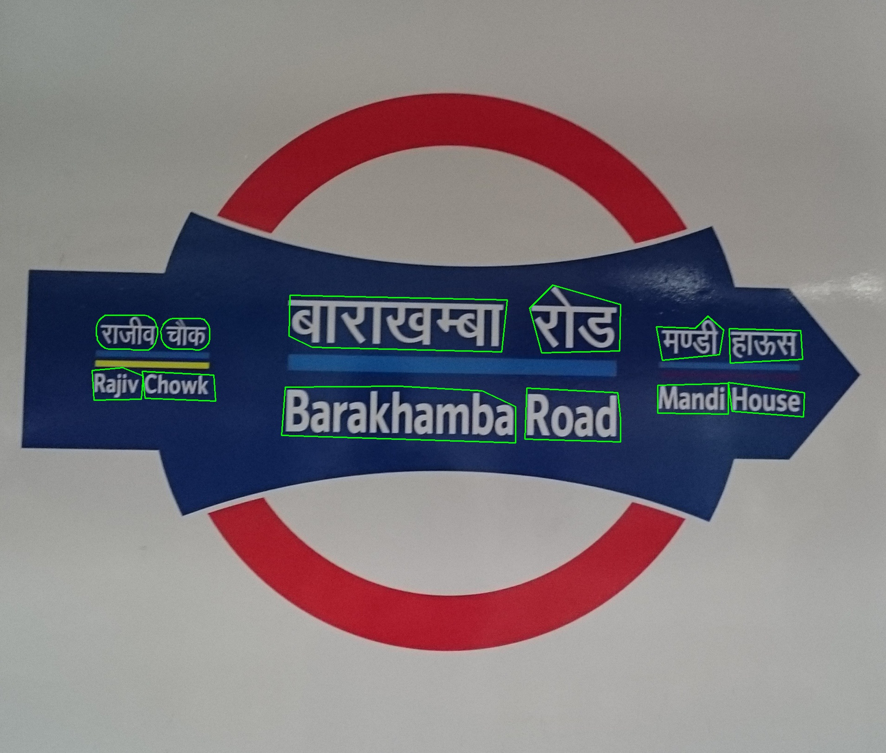
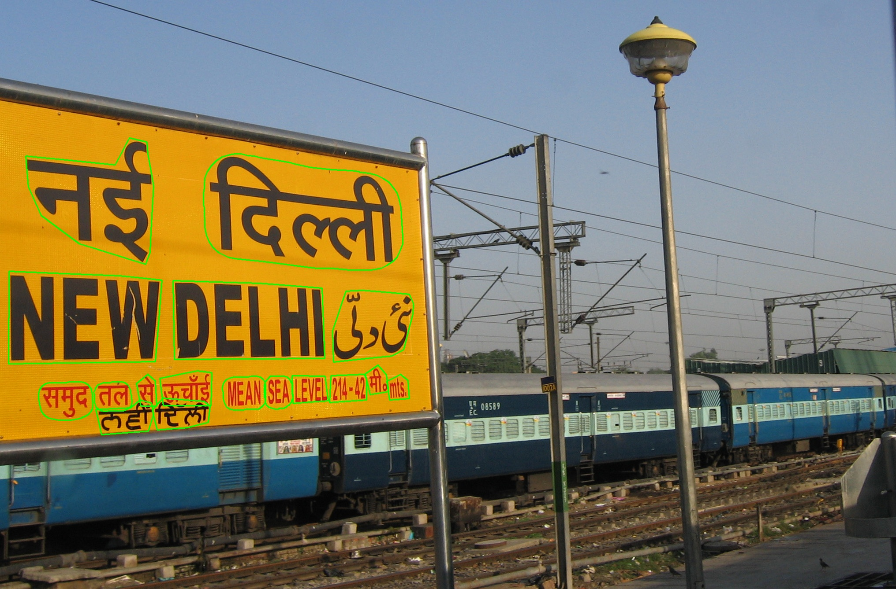

<h1 align="center"> Bharat Scene Text Dataset (BSTD)</h1>

<div align="center">

[](https://github.com/Bhashini-IITJ/BharatSceneTextDataset/stargazers/)


</div>

We introduce the Bharat Scene Text Dataset (BSTD) — a large-scale benchmark for Indian language scene text recognition, consisting of **6,582 scene images** featuring **1,26,292 words** in 11 Indian languages and English. Each image is manually annotated with polygon-level bounding boxes and corresponding transcription and script, ensuring high-quality data for research and applications.

---

## 📌 Release Updates

- **[8/8/24]** First Public Release.

---

## 📊  Data Statistics

### Scene Text Detection

| Total #Images | #Train Images | #Test Images | #Total Detection Annotations | #Train Bboxes | #Test Bboxes |
| :---: | :---: | :---: | :---: | :---: | :---: |
| 6,582 | 5,263 | 1,319 | 1,26,292 | 94,128 | 32,164 |

### Cropped Word Recognition

| Language | #Total Recognition Annotations | #Train | #Test |
| :---: | :---: | :---: | :---: |
| Assamese | 4,132 | 2,627 | 1,505 |
| Bengali | 6,304 | 4,936 | 1,368 |
| English | 41,696 | 29,123 | 12,573 |
| Gujarati | 2,899 | 1,884 | 1,015 |
| Hindi | 19,773 | 14,927 | 4,846 |
| Kannada | 2,928 | 2,208 | 720 |
| Malayalam | 2,940 | 2,393 | 547 |
| Marathi | 5,113 | 3,917 | 1,196 |
| Odia | 4,192 | 3,148 | 1,044 |
| Punjabi | 11,199 | 8,319 | 2,880 |
| Tamil | 2,542 | 2,029 | 513 |
| Telugu | 2,760 | 2,215 | 545 |
| Others | 19,814 | - | - |
| **Total** | **1,26,292** | **77,726** | **28,752** |

---

## 🎯 Supported Tasks

### Task 1: Scene Text Detection

> 📥 **Data Download**: Download the `detection.zip` from this **[link](https://drive.google.com/file/d/16irnMGdT8ohhvfMMG3qbBKWKxcPLNF0y/view?usp=share_link)** (zip file ~17 GB). Annotations are in `BSTD_v17.57.json`.

**File Structure**:
```text
Detection/
│
├── A/
│   ├── image_xx.jpg
│   └── ...
├── B/
├── ...
└── BSTD_v17.57.json
```

<details>
<summary><b>View Annotation Format (BSTD_v17.57.json)</b></summary>

Words in the image are annotated in a polygon format. The annotation file is structured as follows:
```json
{
    "folderName_image_id": {
        "annotations": {
            "polygon_0": {
                "coordinates": [ [x1, y1], [x2, y2], [x3, y3], [x4, y4] ],
                "text": "text in the current polygon",
                "script_language": "language of the word present in the polygon."
            }
        },
        "image_name": "path to the image (e.g., A/image_xx.jpg)",
        "split": "train/test split",
        "url": "url of the source image from Wikimedia",
        "folderName": "folder of the image (e.g., A)",
        "environment": "environment condition (e.g., outdoor/indoor)",
        "lighting": "lighting condition (e.g., day/night)"
    }
}
```
</details>

### Task 2: Cropped Word Recognition

> 📥 **Data Download**: Download the `recognition.zip` from this **[link](https://drive.google.com/file/d/1d8yOLWrStRTmB8nIJG3mi-w5P9IzB_z8/view?usp=sharing)**.

**File Structure**:
```text
Recognition/
│
├── train/
│   ├── assamese/
│   │   ├── X_image_name_xx_xx.jpg
│   │   └── ...
│   ├── bengali/
│   ├── ...
│   └── telugu/
├── test/
│   ├── assamese/
│   ├── bengali/
│   ├── ...
│   └── telugu/
├── train_recognition_data.json
└── test_recognition_data.json
```

<details>
<summary><b>View Annotation Format</b></summary>

Files: `Recognition/train_recognition_data.json` and `Recognition/test_recognition_data.json`.
```json
{
    "A_image_1005_0.jpg": {
        "path": "Recognition/train/english/A_image_1005_0.jpg",
        "language": "english",
        "text": "CULTURAL"
    }
}
```
</details>
<details>
<summary><b>View Data Conversion</b></summary>
To convert the recognition data into LMDB format, use `utils/fetch_lmdb_format_data.py`:
```bash
python3 utils/fetch_lmdb_format_data.py --recognition_folder_path ./Recognition --split train --language hindi --output_directory lmdb/hindi/train/real/hindi
```
To view all arguments:
```bash
python3 utils/fetch_lmdb_format_data.py --help
```
</details>

### Task 3: Script Identification

This task involves identifying the script or language present in a given cropped word image.

The data for evaluating this 12-way script identification task can be sourced directly from the Cropped Word Recognition dataset natively utilizing the `language` tags provided in its json annotations (`Recognition/train_recognition_data.json` and `test_recognition_data.json`). 

> 📥 **Data Download**: Download the `script_identification.zip` from this **[link](https://drive.google.com/drive/folders/1gjdmyTR_9B7U1-W7hWugewnSowjetXYC?usp=drive_link)** used in IJDAR evaluation.

### Task 4: End-to-End Scene Text Recognition

This task evaluates the system in the closest to natural setting. Given a scene image, the task is to recognize all instances of text. 

The model supports for 11 Indian languages and English, which is why images with urdu and meitei texts were discarded from evaluation. 

> 📥 **Data Download**: The set of images used for evaluation in IJDAR version can be found **[here](https://drive.google.com/drive/folders/1-N28ZE-wJzN3sZFXmyGo51tRwtxQITm2?usp=sharing)**.
 
---

## 🛠️ IndicPhotoOCR Toolkit

The open-source **[IndicPhotoOCR](https://github.com/Bhashini-IITJ/IndicPhotoOCR)** toolkit acts as the official strong baseline designed to detect, identify, and recognize text in English and 11 Indian languages.

### Installation
```bash
git clone https://github.com/Bhashini-IITJ/IndicPhotoOCR.git
cd IndicPhotoOCR
chmod +x setup.sh
./setup.sh
```

### Usage
IndicPhotoOCR provides APIs for all four tasks. For example, End-to-End Scene Text Recognition can be executed seamlessly:
```python
from IndicPhotoOCR.ocr import OCR

# Initialize the OCR system with automatic language identification
ocr_system = OCR(identifier_lang="auto")

# Define input image path
image_path = "path/to/image.jpg"

# Perform end-to-end OCR
recognized_words = ocr_system.ocr(image_path)
print(recognized_words)
```
Detailed documentation and robust models for usage of the toolkit are available at the **[IndicPhotoOCR Project Page](https://vl2g.github.io/projects/IndicPhotoOCR/)**.

---

## 🔍 Data Visualisation of Annotations

To natively visualise detection annotations, simply run the following script template:
```bash
python3 visualise.py <image_path> <path_to_BSTD_v17.57.json>
```
For example:
```bash
python3 visualise.py A/image_1005.jpg path_to_BSTD_v17.57.json
```

**Visual Output Examples**:  
  


---

## 📜 Data Annotation Methods
- All images utilized have been collected from Wikimedia Commons strictly under the open Creative Commons Licence (`cc-by-sa-4.0`).
- Dataset detection masks and recognition content are wholly manually curated to enforce robust baselines.

---

## 📚 Related Datasets

### Image subset used in (Vaidya et al., ICPR 2024) [[Preprint](https://arxiv.org/abs/2308.03024)]
> 📥 **Data Download**: 
> - BSTD split format specific for Hindi to English scene text translation modeling can be downloaded from this **[link](https://drive.google.com/file/d/1Vi4aPn8w9R4dpiN6Vlt8__prDwT5c6Yk/view?usp=share_link)**.
> - The raw images specifically used in validation for Hindi to English evaluation can be downloaded **[here](https://drive.google.com/file/d/1jIPl2C-xjFKyAsDMLPuQBPadIJwI0KEN/view?usp=share_link)**.

---

## 🤝 Acknowledgement
This work was partly supported by MeitY, Government of India (Project Number: S/MeitY/AM/20210114) under NLTM-Bhashini.

## 📬 Contact
For any queries, please reach out:
- [Abhirama Subramanyam](mailto:penamakuri.1@iitj.ac.in)
- [Anik De](mailto:anikde@iitj.ac.in)

## 📝 Citation
If you use this benchmark or the tools, please cite our underlying works:
```bibtex
@misc{BSTD,
   title        = {{B}harat {S}cene {T}ext {D}ataset},
   howpublished = {\url{https://github.com/Bhashini-IITJ/BharatSceneTextDataset}},
   year         = 2024,
}
```
